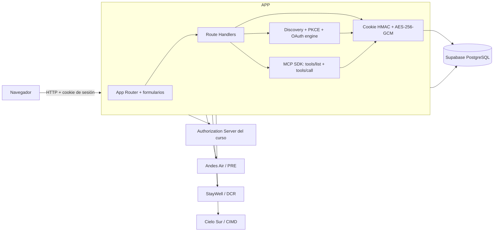
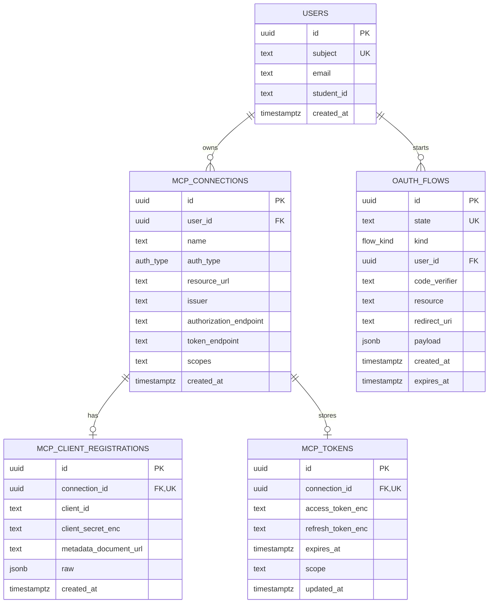
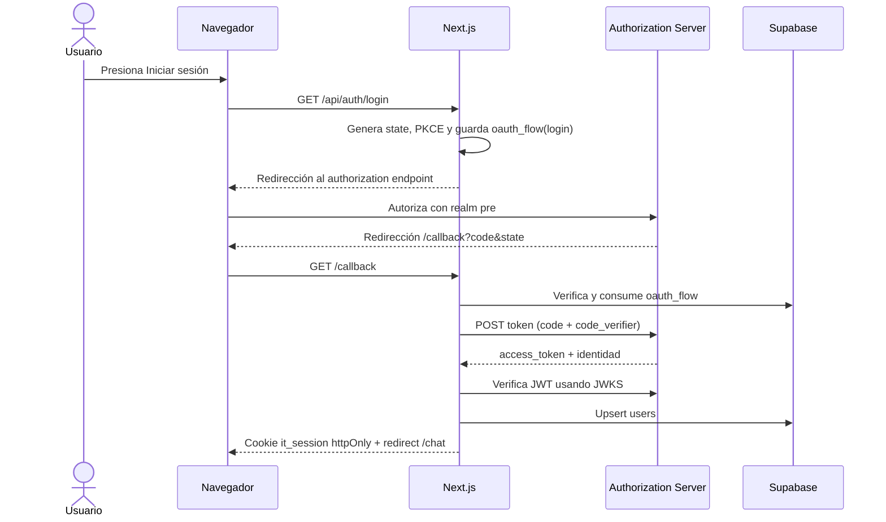
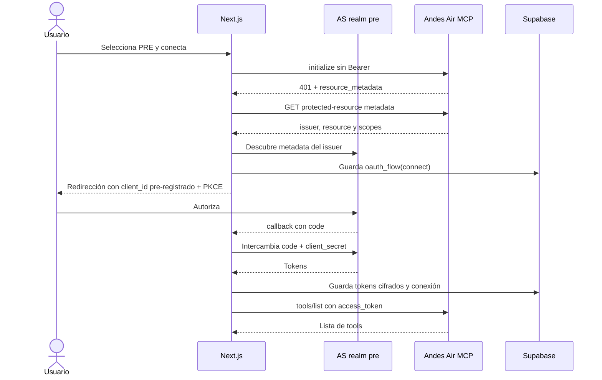
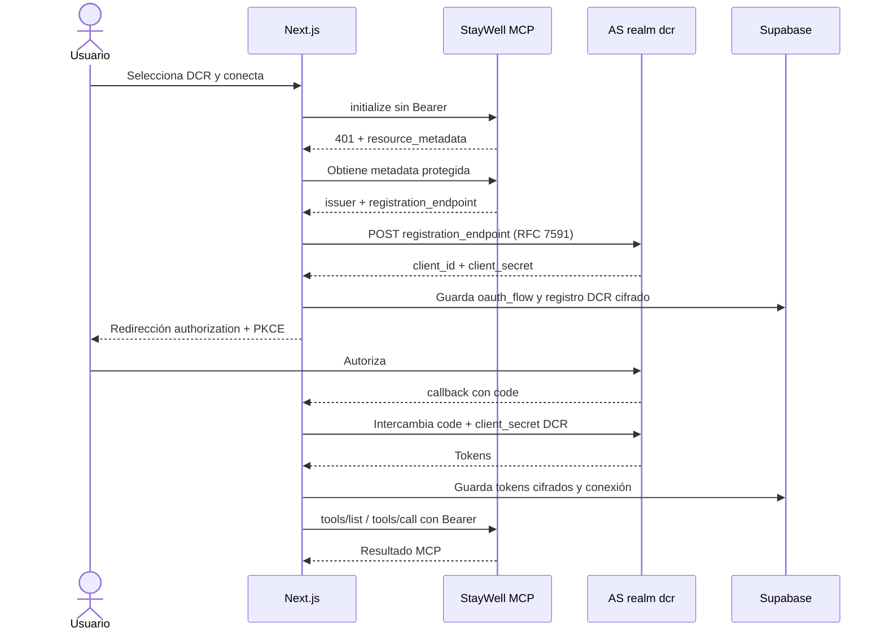
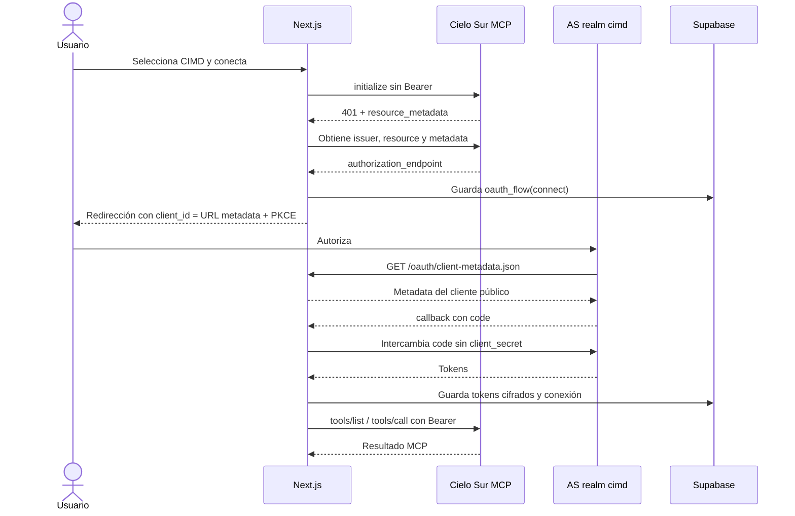

# IntegraTrip — Arquitectura detallada

IntegraTrip es un monolito Next.js que funciona como cliente MCP server-side.
El navegador sólo maneja la interfaz y una cookie de sesión httpOnly; los
tokens OAuth, secretos y llamadas a los servidores MCP pasan por los Route
Handlers del servidor.

## Componentes y responsabilidades

- **Autenticación de la aplicación:** OAuth 2.1 Authorization Code + PKCE
  contra el realm `pre`. Al volver del callback se valida el JWT con JWKS y se
  crea una sesión mínima firmada con HMAC.
- **Discovery MCP:** el cliente hace una primera llamada al recurso protegido,
  obtiene `resource_metadata` desde `WWW-Authenticate` y descubre el issuer,
  authorization endpoint, token endpoint y scopes.
- **OAuth MCP:** el motor común genera PKCE, maneja `state`, intercambia el
  código y refresca tokens. El proveedor sólo decide cómo obtener el
  `client_id`.
- **MCP:** los tokens se descifran únicamente en server-side. El SDK usa
  Streamable HTTP para `tools/list` y `tools/call`.
- **Persistencia:** Drizzle ORM sobre Supabase. Cada consulta de conexiones,
  tokens y flujos OAuth se filtra por el `user_id` de la sesión.

## Modelo entidad-relación

`MCP_CONNECTIONS` es la entidad central. Una conexión tiene como máximo un
registro de cliente y un conjunto de tokens. `MCP_CLIENT_REGISTRATIONS` guarda
el `client_secret` cifrado para DCR/PRE; CIMD no necesita secreto porque su
`client_id` es la URL pública del documento de metadata. `OAUTH_FLOWS` es
temporal y vincula el `state` y el `code_verifier` con el usuario y recurso.

## Flujo común de login de la aplicación

## PRE — Andes Air

PRE usa un cliente confidencial creado previamente en el `/console` del
Authorization Server. El `client_id` y `client_secret` se leen desde variables
de entorno; no hay registro dinámico durante la conexión.

## DCR — StayWell

DCR usa Dynamic Client Registration (RFC 7591). Antes de redirigir al usuario,
la app registra un cliente nuevo con su `redirect_uri`; el servidor devuelve un
`client_id` y un `client_secret` que se almacenan cifrados.

## CIMD — Cielo Sur

CIMD usa Client ID Metadata Documents. No registra un cliente mediante una
llamada de registro y no necesita secreto. El `client_id` es la URL HTTPS
estable de `/oauth/client-metadata.json`; el Authorization Server obtiene ese
documento desde la aplicación.

## Diferencias entre PRE, DCR y CIMD

| Mecanismo | Obtención del `client_id` | Secreto | Momento de obtención |
|---|---|---|---|
| PRE | Cliente creado en el `/console` | Sí, en variables de entorno | Configuración previa |
| DCR | Registro RFC 7591 | Sí, entregado por el registro | Durante la conexión |
| CIMD | URL HTTPS del documento de metadata | No, cliente público | La URL se construye desde `APP_BASE_URL` |

El resto del flujo es compartido: discovery del recurso protegido, PKCE
S256, `state`, autorización, intercambio de código, persistencia cifrada y
llamadas MCP con Bearer. La única variación de implementación es el proveedor
que resuelve las credenciales del cliente.

## Logout seguro

El logout se implementa como un formulario `POST` a `/api/auth/logout`. No se
usa un `Link` ni un endpoint `GET` que cambie estado: Next.js puede precargar
los enlaces y una precarga nunca debe eliminar la sesión. El endpoint borra la
cookie sólo después de la acción explícita del usuario y redirige al inicio.
